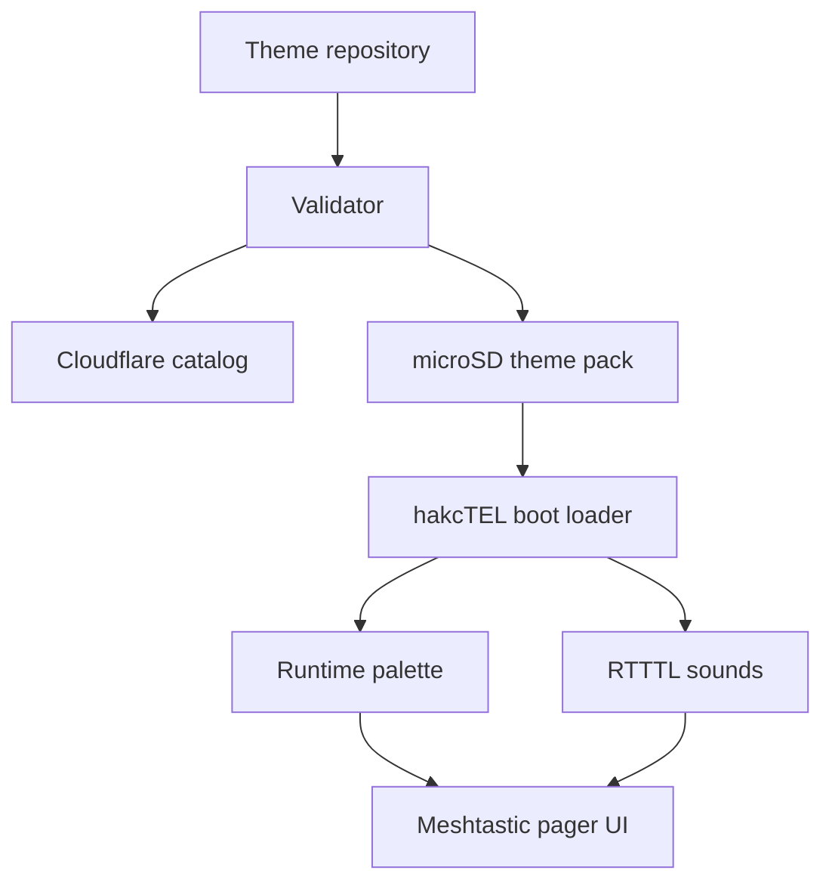

# hakcTEL


Retro pager firmware for the LILYGO T-LoRa Pager, built on Meshtastic.

hakcTEL keeps Meshtastic messaging, LoRa, GPS, Bluetooth, Wi-Fi, the physical keyboard, rotary input, haptics, audio, NFC hardware access, and microSD support. It adds a data-only theme format, matching RTTTL sound packs, nostalgic pager and PDA skins, a passive tools catalog, release automation, and a browser flasher for `hakctel.hakc.ai`.

This repository starts from the Meshtastic `develop` branch. The first hakcTEL release focuses on a stable themed Meshtastic base. Tools that need external radios or transmit capability stay feature-gated until they have hardware tests and clear regional safety limits.

## Included themes

| Theme | Inspiration | Character |
| --- | --- | --- |
| PageWriter 2000X | Late 1990s two-way pager | Blue gray shell, green LCD, compact inbox |
| Advisor Gold | Numeric pager | Amber LCD and blunt status blocks |
| Matrix Green | Dot-matrix terminal | Green phosphor, dense pixels |
| BlackBerry 9900 | Keyboard-first communicator | Black chrome, blue selection bars |
| HP Jornada | Pocket PC | Windows CE-era navy and silver |
| Palm Pilot | Early PDA | Gray-green monochrome organizer |
| Palm Treo | Smartphone organizer | Warm gray, blue title bars, red accent |
| Nextel Direct Connect | Push-to-talk handset | Black and yellow PTT channel screen |
| Amber Terminal | Portable serial terminal | Amber phosphor and hard borders |
| Tokyo Night | Modern retro terminal | Indigo, cyan, violet |
| hakcTEL Cyberdeck | Original hakcTEL skin | Plum, cyan, near-black |

Preview every theme in [`site/index.html`](site/index.html) or open [`docs/mockups/theme-contact-sheet.png`](docs/mockups/theme-contact-sheet.png). The Cloudflare site also acts as a full Theme Archive: search the catalog, download packs, connect a mounted SD card, detect installed versions, install or update verified themes, and select the active pack.

## Hardware baseline

Target: LILYGO T-LoRa Pager, Meshtastic hardware model `T_LORA_PAGER`.

- ESP32-S3 with 8 MB PSRAM and 16 MB flash
- 480 x 222 ST7796 color display
- SX1262, SX1280, or LR1121 LoRa module, depending on board SKU
- TCA8418 keyboard and rotary encoder
- GNSS, RTC, haptics, BHI260AP smart motion sensor
- ES8311 I2S audio codec, microphone path, and speaker amplifier
- ST25R3916 NFC controller
- microSD on SPI
- Dedicated external nRF24L01 PA header

The BHI260AP is a programmable smart motion sensor, not a general-purpose AI accelerator. hakcTEL's Edge Actions feature uses its low-power motion outputs for gestures and can optionally run small inference models on the ESP32-S3.

Confirm your radio SKU and regional frequency before flashing or transmitting.

## Quick start

```bash
./installer.sh
source .venv-hakctel/bin/activate
./scripts/build.sh
./scripts/flash.sh /dev/ttyACM0
```

The build output is copied to `dist/`. For a browser install, deploy `site/` to Cloudflare Pages and publish the generated release artifacts described in [`docs/web-installer.md`](docs/web-installer.md).

Neither `scripts/flash.sh` nor the browser installer touches the microSD-adjacent `spiffs` filesystem partition (node database, message history, drafts) — they write only the bootloader, partition table, and app image. Switching firmware families or clearing out stale state needs a real erase:

```bash
./scripts/erase.sh /dev/ttyACM0
```

Prepare the microSD card before flashing, so the Pager boots into a theme rather than the stock palette:

```bash
./scripts/prep_sd.sh /media/SDCARD
```

## SD card layout

```text
/hakctel/
  active-theme.txt
  themes/
    pagewriter-2000x/
      theme.ini
    blackberry-9900/
      theme.ini
    nextel-direct-connect/
      theme.ini
    ...
```

Prepare the card before you flash. The firmware reads its theme from the card, not from flash, so a freshly flashed Pager with a bare card logs `no theme on card` and stays on the stock palette.

```bash
./scripts/prep_sd.sh /media/SDCARD
```

It creates `/hakctel/themes/`, copies all 11 packs, keeps any `active-theme.txt` you already have, and tells you when the card is ready to flash. It only writes inside `/hakctel/` and deletes nothing. Run it with `-y` to skip the confirmation. The script also works on its own, without a checkout, by cloning this repository for you.

To do it by hand instead: copy the repository `themes/` directory to `/hakctel/themes/` on a FAT32 microSD card. Put one theme ID in `/hakctel/active-theme.txt`, or leave that file out and the firmware boots PageWriter 2000X. Theme files are data only and cannot load native code.

To pull a verified pack from the hosted theme repository onto a mounted card:

```bash
python tools/theme_sync.py --sd-root /media/SDCARD --theme nextel-direct-connect
```

## Theme and sound flow



## Build profiles

| Environment | Purpose |
| --- | --- |
| `hakctel` | hakcTEL on the standard Meshtastic pager UI |
| `tlora-pager` | Upstream Meshtastic Pager build |
| `tlora-pager-tft` | Upstream LVGL device UI build |

## Push-to-talk

The Nextel theme includes hold-to-talk control backed by Meshtastic's Codec2 audio module. On the SX1280 Pager SKU, hold Space to transmit and release to listen. It uses the Pager microphone and speaker and requires an encrypted private channel plus an audio-permitted 2.4 GHz radio profile. LoRa airtime is scarce, so this is short-burst group voice, not cellular iDEN and not full duplex. Hardware validation with two Pager units is still required before calling it production-ready.

## Tool policy

The tool framework is deliberately capability-gated. Passive discovery and local diagnostics are the default. Anything that transmits outside normal Meshtastic operation must show frequency, power, region, and an explicit confirmation screen.

Planned and specified tools include:

- LoRa spectrum and channel occupancy view
- Wi-Fi channel survey and BLE advertisement inventory
- GPS and wardrive logging to microSD
- NFC NDEF reader and tag inspector
- I2C bus explorer and GPIO monitor
- nRF24 receive and diagnostics support using the Pager's external header
- packet capture export for authorized lab analysis
- Edge Actions for gesture macros and optional TinyML models
- Tone Lab, an original pocket synth using the Pager speaker and keyboard

GLIDE is not copied into this tree. Its current license is PolyForm Noncommercial and its implementation targets M5Stack Cardputer hardware. [`docs/glide-integration.md`](docs/glide-integration.md) defines a clean optional port boundary so users can add it without mixing incompatible licenses into the GPL firmware.

## Documentation

- [`docs/flashing.md`](docs/flashing.md)
- [`docs/repository-setup.md`](docs/repository-setup.md)
- [`docs/architecture.md`](docs/architecture.md)
- [`docs/themes.md`](docs/themes.md)
- [`docs/theme-sync.md`](docs/theme-sync.md)
- [`docs/tools.md`](docs/tools.md)
- [`docs/hardware.md`](docs/hardware.md)
- [`docs/ptt.md`](docs/ptt.md)
- [`docs/edge-actions.md`](docs/edge-actions.md)
- [`docs/web-installer.md`](docs/web-installer.md)
- [`CONTRIBUTING.md`](CONTRIBUTING.md)
- [`THEME_CONTRIBUTING.md`](THEME_CONTRIBUTING.md)

## Status

The repository contains a Meshtastic fork plus the hakcTEL theme and sound loader, sample packs, theme tooling, web installer, and CI configuration. Host-side theme tests pass. A complete firmware compile is also run by CI; see the current workflow result after pushing. Hardware tools are staged behind capability flags. A menu entry is not treated as proof that a radio or sensor feature works.

## License and attribution

hakcTEL modifications are GPL-3.0-or-later. Meshtastic retains its upstream license and notices. Theme artwork and sounds in this repository are original unless a pack says otherwise. Device and product names are used only to describe historical inspiration.
