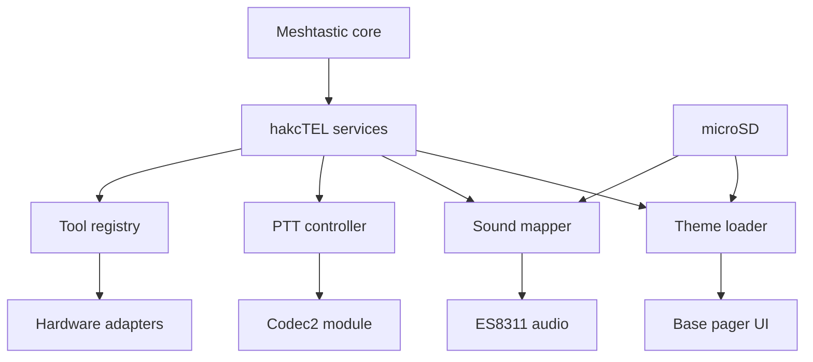

# Architecture

hakcTEL is a narrow layer over Meshtastic. Mesh routing, encryption, device configuration, Bluetooth, Wi-Fi, GPS, radio drivers, and power management remain upstream code. hakcTEL adds only the pieces that need to differ.

## Design rules

1. Preserve Meshtastic packet compatibility.
2. Keep themes data-only.
3. Fail closed when a theme is invalid.
4. Keep radio transmit tools disabled unless hardware, region, and operator intent are known.
5. Put recordings, scans, and exports on microSD, not internal flash.
6. Keep custom code behind `HAKCTEL_FIRMWARE` so upstream comparison stays simple.

## Boot order

1. Meshtastic initializes the board and mounts microSD.
2. NodeDB restores user and display configuration.
3. hakcTEL reads `/hakctel/active-theme.txt`.
4. The theme parser validates `/hakctel/themes/<id>/theme.ini`.
5. The runtime palette is installed before the display starts.
6. After the audio codec starts, hakcTEL plays the theme boot sound.
7. The external notification module uses the theme message sound.

## Update boundaries

Firmware updates use signed GitHub releases and the browser flasher. Theme updates are independent files and never replace executable partitions. This keeps a broken theme recoverable by removing the card or deleting `active-theme.txt`.
